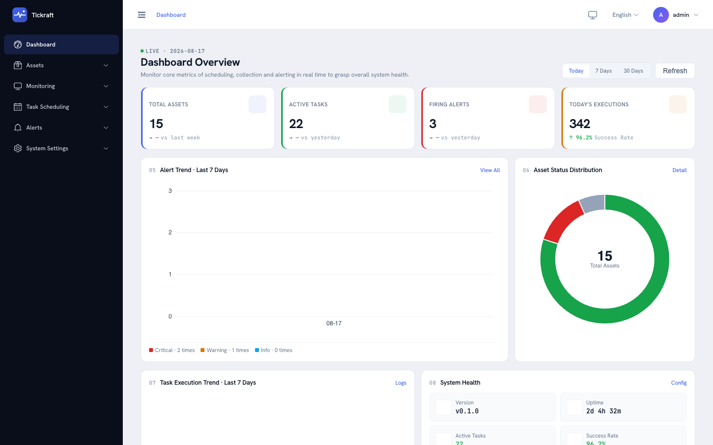
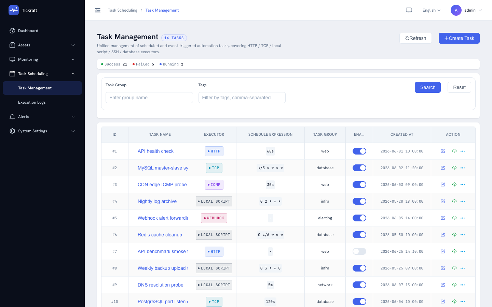
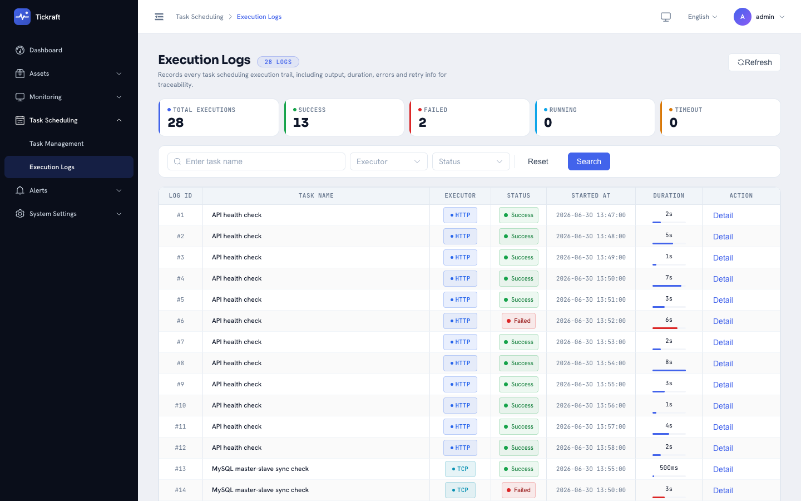
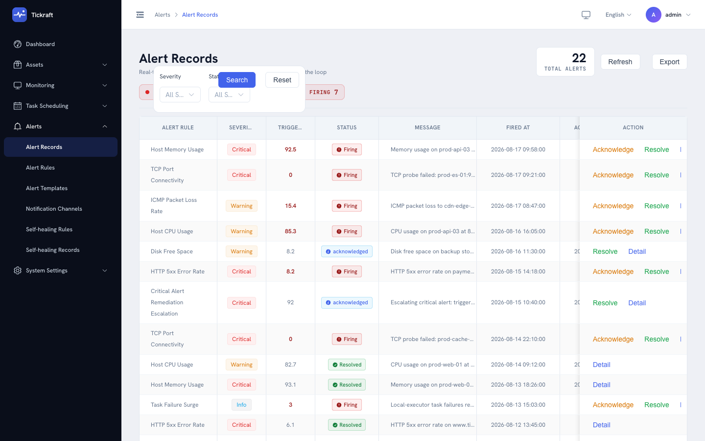
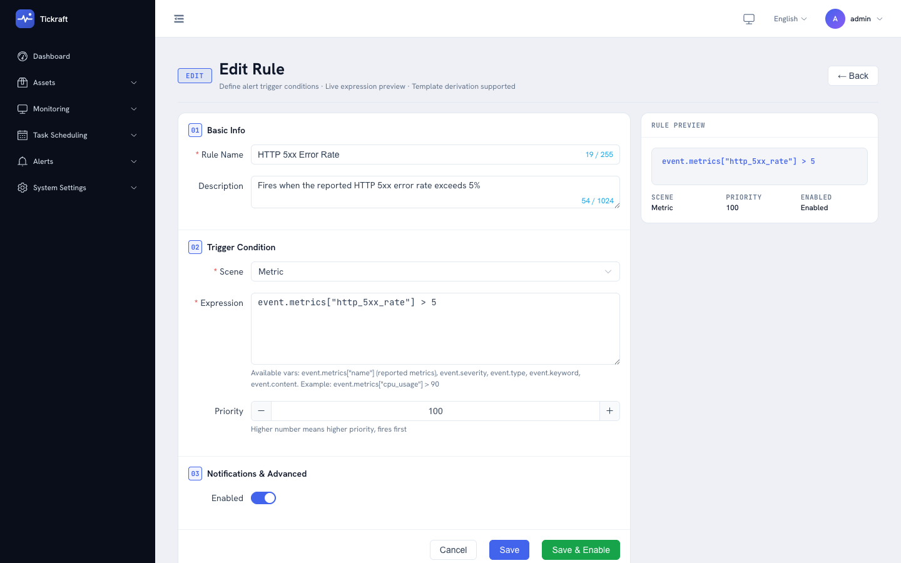

# Tickraft

**轻量级一体化定时任务调度、可用性监控与告警平台 —— 单个自托管二进制文件。**

[](LICENSE)
[](https://golang.org)
[](https://github.com/tickraft/tickraft/actions/workflows/ci.yaml)

[](https://github.com/tickraft/tickraft/stargazers)
[](https://github.com/tickraft/tickraft/graphs/contributors)
[](https://github.com/tickraft/tickraft/issues)
[](CONTRIBUTING.md)

[English](./README.md) | **简体中文**



## 为什么选择 Tickraft？

小团队通常要把 crontab、独立的拨测工具、一堆告警脚本和一张资产表格拼在一起用。Tickraft 用**一个自包含的 Go 二进制**替代这套拼凑组合：REST API、Vue 3 网页控制台、调度引擎、执行引擎、遥测管道和告警引擎全部运行在单进程、单端口内。

- **单二进制、零外部依赖** —— 内嵌 SQLite、内嵌前端,无需外部数据库、消息队列或 Web 服务器
- **运维闭环全覆盖** —— 调度 → 执行 → 监控 → 告警 → 自愈
- **内核优先架构** —— 每个引擎都是可复用的独立包,并提供 SPI 扩展点(Go 侧 `pkg/`,前端侧 `web/packages/`)
- **中英双语界面** —— 开箱即用支持 English 与 简体中文
- **极致轻量** —— 单端口(`:6153`)、单份 YAML 配置(支持环境变量插值),从树莓派到云主机都能跑

本仓库是 Tickraft 的开源版,采用 AGPLv3 + 商业授权双协议模式(见[许可证](#许可证))。

## ✨ 功能特性

### ⏰ 灵活调度

- 支持 **cron 表达式**(5/6 字段、`@every`、`TZ=` 时区前缀)、**固定间隔**、**一次性**与**事件触发**四种调度方式
- 分层时间轮引擎,任务分片归属 + 有界工作池
- 重试策略、手动触发、暂停/恢复、复制为模板、标签与分组
- 任务依赖(上游完成后才执行),执行历史与统计一应俱全

### 🔁 内置执行器

- **本地(local)** —— 执行 Shell 命令或脚本
- **Webhook** —— 调用外部 HTTP 接口
- **HTTP / TCP / ICMP 探测** —— 可用性与时延检查

### 📡 主动 + 被动监控

- 按调度执行主动探测(ICMP Ping、TCP 端口、HTTP),内置探测模板(`icmp-ping`、`http-homepage`、`https-api`、`tcp-database`)
- 被动上报接口 `POST /api/v1/telemetry`,供 Agent 与脚本推送数据,支持 HMAC-SHA256 签名或资产密钥认证
- 落库前按滚动窗口聚合(平均/最大/最小/计数/求和);指标、日志、心跳均支持
- 界面提供监控点状态历史与趋势图表

### 🚨 告警(Prism)

- 基于 [expr-lang](https://expr-lang.org/) 的规则引擎,沙箱化求值(节点数/比较次数限制)
- 告警生命周期管理 —— 触发、确认(acknowledge)、解决(resolve) —— 记录可检索
- 告警去重治理,抑制告警风暴
- 通知渠道:**邮件**(TLS none/implicit/STARTTLS,认证 PLAIN/LOGIN/CRAM-MD5)与 **Webhook**(可对接 Slack、Telegram、钉钉、飞书等任何接收 POST 的服务);更多渠道可通过渠道 SPI 插入
- 通知内容支持模板渲染

### 🩹 故障自愈

- 自愈规则按匹配的告警选择执行体:执行**本地**脚本、调用 **Webhook** 或 **HTTP** 接口
- 内置安全护栏:幂等键、冷却窗口、熔断器(自动暂停失控的自愈动作)

### 📦 资产管理

- 六类资产:任务、设备、主机、端口、网站、服务
- 四态生命周期(正常/异常/离线/未知),状态变更历史可审计
- 单个资产一键手动探测

### 🔐 安全

- JWT access/refresh 双令牌(可吊销)、API Key(哈希存储、可吊销、带缓存)
- TOTP 双因素认证(MFA)、首次登录强制改密流程
- 基于角色的访问控制(RBAC):管理员 / 开发者 / 访客
- TLS 热加载,ACME(Let's Encrypt)HTTP-01 自动签发,以及 `cert selfsign` 自签命令

### 🧰 其他能力

- WebSocket 端点实时推送系统事件
- `/api/v1` 下约 80 个 REST 接口,并提供 OpenAPI 描述([docs/api/openapi.yaml](docs/api/openapi.yaml))
- 强类型进程内事件总线(20+ 事件类型),失败事件持久化支持重放
- i18n 接口直接提供内嵌语言包
- 后端基于 Go 1.26(Hertz、GORM、expr-lang、cobra、zap),前端为 Vue 3 + TypeScript + Element Plus + ECharts

## 🚀 快速开始

在首个版本号发布预编译产物之前,请从源码构建:

```bash
# 前置要求:Go 1.26+、Node.js 22+、pnpm 9+
git clone https://github.com/tickraft/tickraft.git
cd tickraft
make build

# 使用内置开发默认配置启动(SQLite + 开发用 JWT 密钥)
./bin/tickraft start
```

然后打开 <http://localhost:6153>,以 `admin` 登录。密码读取环境变量 `TICKRAFT_ADMIN_PASSWORD`;若未设置,启动时会生成随机密码并在日志中打印一次。

使用配置文件的方式:

```bash
cp configs/config.example.yaml config.yaml
# 直接修改配置,或导出环境变量:
#   TICKRAFT_JWT_SECRET      令牌签名密钥
#   TICKRAFT_ADMIN_PASSWORD  初始管理员密码
#   TICKRAFT_DB_DSN          例如 sqlite:///app/data/tickraft.db
./bin/tickraft config validate -c config.yaml
./bin/tickraft start -c config.yaml
```

Linux / macOS / Windows(amd64 / arm64)的预编译二进制与官方容器镜像将随每个发布版本出现在 [Releases](https://github.com/tickraft/tickraft/releases) 页面。

## 🐳 Docker

官方镜像将随首个发布版本推出,当前可自行构建:

```bash
docker build -t tickraft-ce .
docker run -d --name tickraft -p 6153:6153 \
  -v tickraft-data:/app/data \
  -v $(pwd)/config.yaml:/app/config.yaml \
  -e TICKRAFT_JWT_SECRET="your-secret-key" \
  -e TICKRAFT_ADMIN_PASSWORD="your-admin-password" \
  -e TICKRAFT_DB_DSN=sqlite:///app/data/tickraft.db \
  tickraft-ce start --config /app/config.yaml
```

## 🖥️ 界面截图

| 控制台总览 | 定时任务 | 执行日志 |
|:---:|:---:|:---:|
| [](docs/screenshots/dashboard.png) | [](docs/screenshots/scheduler-task-list.png) | [](docs/screenshots/scheduler-log-list.png) |

| 资产管理 | 监控点 | 告警记录 |
|:---:|:---:|:---:|
| [](docs/screenshots/collector-asset-list.png) | [](docs/screenshots/collector-prober-list.png) | [](docs/screenshots/prism-record-list.png) |

| 告警规则编辑 | 故障自愈 |
|:---:|:---:|
| [](docs/screenshots/prism-rule-edit.png) | [](docs/screenshots/prism-remediation-list.png) |

包含全部界面的完整图集见[用户指南](docs/zh-CN/user-guide.md)。

## 🏗️ 架构


Tickraft 由多个相互独立的引擎组成,引擎之间只通过强类型事件总线通信:

| 模块 | 包 | 职责 |
|---|---|---|
| 调度器 | `pkg/scheduler`、`pkg/cron`、`pkg/task`、`pkg/timewheel` | 任务元数据、时间轮触发、分片分发、依赖编排 |
| 执行器 | `pkg/executor` | 事件驱动执行、重试、执行记录、能力模型 |
| 遥测 | `pkg/telemetry` | 主动探测与被动上报、校验、窗口聚合、持久化 |
| 告警 | `pkg/prism` | 告警规则求值、通知渠道、自愈分发 |
| 基础层 | `pkg/event`、`pkg/pool`、`pkg/auth`、`pkg/api`、`pkg/db` 等 | 事件总线、协程池、认证/RBAC、HTTP 中间件、存储 SPI |

每个引擎都暴露 SPI —— 执行器注册表、通知渠道工厂、遥测处理器、HTTP API 插件(`pkg/api.Plugin`)、存储驱动 —— 下游版本与分支仓库无需改动内核即可扩展。规则详见 [docs/zh-CN/module-boundary.md](docs/zh-CN/module-boundary.md) 与 [docs/zh-CN/extension-guide.md](docs/zh-CN/extension-guide.md)。

## 📚 文档

| 文档 | 内容 |
|---|---|
| [快速上手](docs/zh-CN/getting-started.md) | 8 步从零到第一个定时任务 |
| [用户指南](docs/zh-CN/user-guide.md) | 全部界面逐一讲解,附截图 |
| [配置说明](docs/zh-CN/configuration.md) | 全部配置项、环境变量插值、版本配额 |
| [架构设计](docs/zh-CN/architecture.md) | 引擎划分、数据流、持久化模型 |
| [部署指南](docs/zh-CN/deployment.md) | 交叉编译、Docker、系统要求 |
| [扩展指南](docs/zh-CN/extension-guide.md) | 基于 SPI 扩展执行器、渠道、API 插件 |
| [模块边界](docs/zh-CN/module-boundary.md) | `pkg/`、`cmd/`、`internal/` 之间的依赖规则 |
| [REST API](docs/api/openapi.yaml) | `/api/v1` 的 OpenAPI 描述 |

英文版文档(权威版本)见 [docs/](docs/README.md)。

> **版本说明:**开源版内置软配额(例如 20 个资产、20 个监控点、20 个定时任务 —— 完整清单见[配置说明](docs/zh-CN/configuration.md))。它们是编译期默认值而非硬限制,重新编译即可解除。

## 🛠️ 开发调试

```bash
# 前端(Vue 3 + Vite 开发服务器,端口 5173,/api 代理到 6153)
cd web && pnpm install && pnpm dev

# 后端
go run ./cmd/tickraft start
```

完整的开发环境、代码规范与 PR 流程见 [CONTRIBUTING.md](CONTRIBUTING.md)。后端检查:`make lint test`;前端检查:`pnpm -C web lint test type-check`。

## 🤝 参与贡献

欢迎贡献!请先阅读 [CONTRIBUTING.md](CONTRIBUTING.md) —— 贡献者在首个 PR 前需签署 [CLA](CLA.md),提交信息遵循 [Conventional Commits](https://www.conventionalcommits.org/),每个 PR 都会在 CI 中通过 lint、测试与许可证头检查。

发现 Bug 或有新想法?欢迎[提交 Issue](https://github.com/tickraft/tickraft/issues) 或发起 [Discussion](https://github.com/tickraft/tickraft/discussions)。安全漏洞报告请遵循 [SECURITY.md](SECURITY.md)。

## ⭐ 支持一下

如果 Tickraft 把你从 crontab 的考古工作中解救出来,欢迎给个 Star —— 让更多人看到这个项目。

## 许可证

本仓库采用 **AGPLv3 + 商业授权双协议** 模式，使用者可在两种协议中任选其一：

- **AGPLv3（默认）**：适用于开源使用者。衍生作品与网络服务（SaaS）必须以 AGPLv3 开源全部代码。详见 [LICENSES/AGPLv3.txt](LICENSES/AGPLv3.txt)。
- **商业授权**：适用于商业使用者（企业私有化部署、SaaS 服务商）。签署商业授权协议后豁免 AGPLv3 全部义务，可闭源分发与 SaaS 化。详见 [LICENSES/COMMERCIAL.txt](LICENSES/COMMERCIAL.txt)。

协议选择指引与完整声明详见 [LICENSE](LICENSE)。商业授权咨询请联系 licensing@tickraft.com。

Tickraft 由 Auzeka Labs 团队维护。
