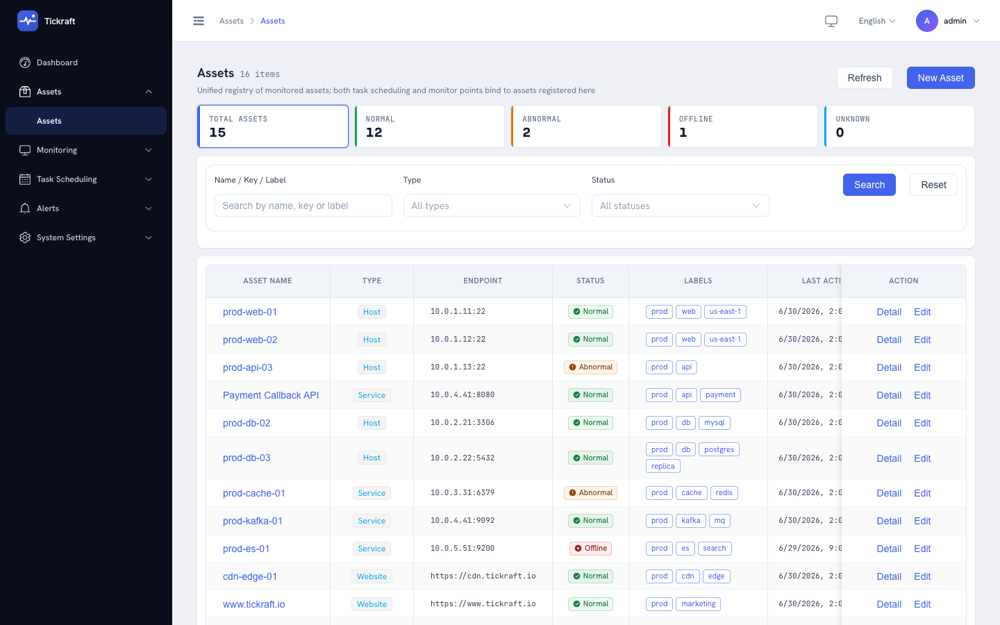
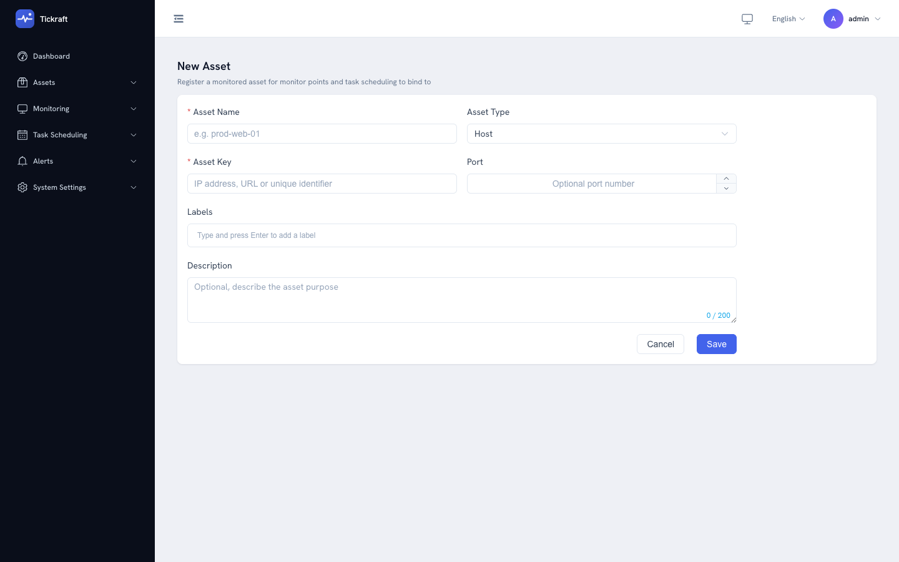
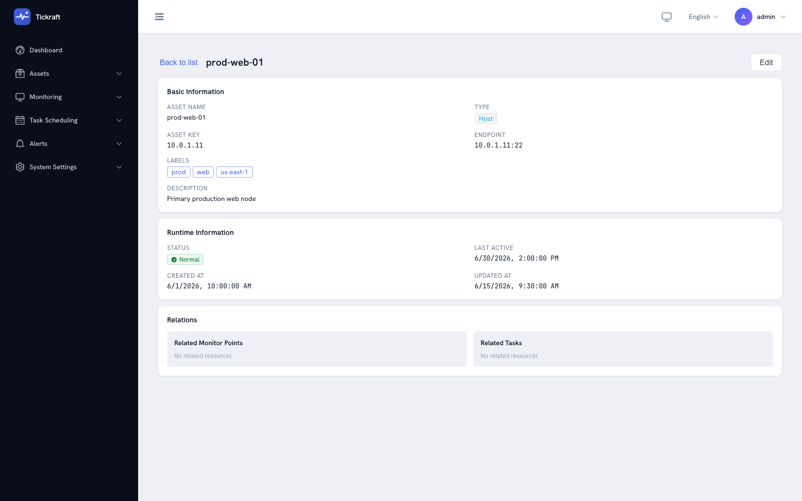
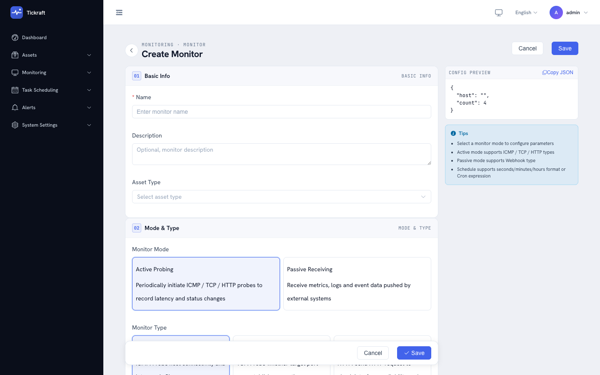
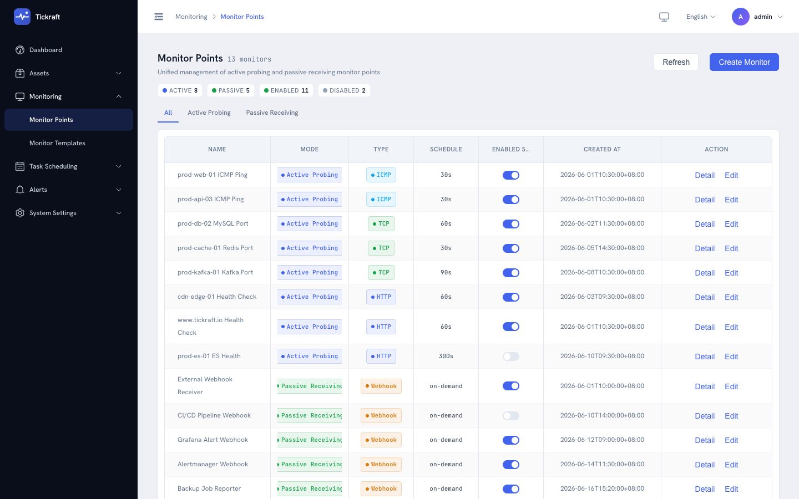
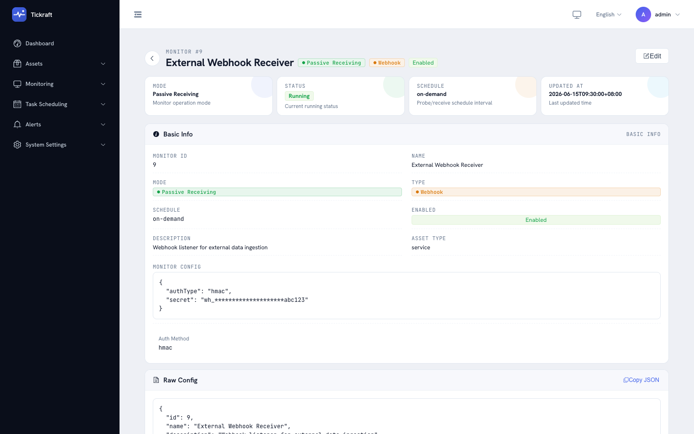

# User guide

This guide walks through every screen in the Tickraft web UI. Each section explains what the page does, how to use it, and what to look for. Screenshots were captured from the open-source edition running with mock data.

## Table of contents

- [Login & authentication](#login--authentication)
- [Dashboard](#dashboard)
- [Scheduler](#scheduler)
  - [Task list](#task-list)
  - [Create a task](#create-a-task)
  - [Task detail](#task-detail)
  - [Execution logs](#execution-logs)
- [Collector](#collector)
  - [Assets](#assets)
  - [Probers](#probers)
  - [Listeners](#listeners)
- [Prism](#prism)
  - [Alert records](#alert-records)
  - [Alert rules](#alert-rules)
  - [Remediation](#remediation)
- [System](#system)
  - [Settings](#settings)
  - [API keys](#api-keys)
  - [System info](#system-info)
- [Open-source edition limits](#open-source-edition-limits)

---

## Login & authentication

The login page is the entry point to the console. Sign in with the built-in `admin` user and the password configured via `TICKRAFT_ADMIN_PASSWORD` (or the auto-generated password logged at startup).

**First login.** On first login you are forced to change your password. Pick a strong password and confirm it — you will be redirected to the dashboard.

**Subsequent logins.** After the initial password change, the login form accepts the new password directly. A "Remember me" checkbox keeps the session token in local storage; unchecking it stores the token only for the browser session.

**Token refresh.** The access token expires after `auth.access_ttl` (default 2 h). The frontend automatically refreshes it using the refresh token. If both expire, you are redirected back to this page.

## Dashboard

The dashboard is the landing page after login. It rolls up the system's health into one view:

- **Stat cards** — total tasks, monitored assets, today's executions, and today's success rate.
- **Task success-rate trend** — a line chart showing the success rate over the last 24 hours.
- **Asset status breakdown** — how many assets are normal vs. abnormal.
- **Recent alerts** — the most recent alert records fired by the prism engine.

Click any card or chart to drill into the corresponding module.

## Scheduler

The scheduler module manages periodic and event-driven tasks. Each task defines *what* to execute (executor type + config), *when* to execute (schedule), and *what happens on failure* (retry policy).

### Task list

The task list shows every registered task in a paginated table. Each row displays the task name, executor type, schedule, enabled toggle, last run time, next run time, and quick actions.

**Filtering.** Use the search bar to filter by name, or the dropdown filters to narrow by executor type, schedule type, or enabled state.

**Quick actions.** Each row has buttons to:
- **Trigger** — run the task immediately (bypassing the schedule).
- **Toggle** — enable or disable the task.
- **Copy** — clone the task configuration into a new task.
- **Edit** — open the task editor.
- **Delete** — remove the task (with confirmation).

Click a task name to open its [detail page](#task-detail).

### Create a task

The create page is a form split into sections:

1. **Basic info** — name, description, priority, and tags.
2. **Executor** — choose the executor type. Task-capable types: `local` (script), `webhook` (outbound callback), and `http` (dual-mode: issue an HTTP request as a task action; set `method` in the config for non-GET calls). The form dynamically adapts to show the fields relevant to the chosen executor (e.g. URL + method for `http`, host + port for `tcp`-style probes). Probe-only types (`icmp`, `tcp`) belong to monitoring points and are rejected here with a 400.
3. **Schedule** — pick the schedule type:
   - `interval` — run every N seconds.
   - `cron` — run on a cron expression (e.g. `*/5 * * * *`).
   - `once` — run a single time at the specified moment.
   - `event` — run when a dependency task completes or a status-change event fires.
4. **Retry** — max retries and retry interval for transient failures.
5. **Dependencies** — for event-driven tasks, select which tasks must complete before this one fires.

Click **Save** to register the task. It starts executing according to its schedule immediately.

### Task detail

The detail page shows the full task configuration and its recent execution history:

- **Header** — task name, executor badge, enabled toggle, and action buttons (Edit, Trigger, Pause/Resume, Delete).
- **Configuration summary** — all task parameters in read-only form.
- **Execution history tab** — a table of the most recent executions for this task, showing status, duration, output, and timestamps. Click an execution to see its [log detail](#execution-logs).

### Execution logs

The log list shows execution records across **all** tasks. Each row includes the task name, executor type, status (`success`, `failed`, `timeout`, `running`), duration, retry count, and start/finish times.

**Filtering.** Filter by task name, executor type, status, or time range to narrow the result set.

Click a row to open the [log detail](#execution-logs) page, which shows the full output and error message.

The log detail page displays the complete execution output, error message (if any), retry history, and timing breakdown. Use the **Retry** button to re-run the execution.

## Collector

The collector module ingests monitoring data from two sources: **probers** (active probes that Tickraft sends out) and **listeners** (passive receivers that accept inbound reports). Each probe result is persisted as a probe record (`sys_probe_record`) and refreshes the monitor point's runtime status; listener reports flow through the collection pipeline and drive the asset status machine.

### Assets

An asset is any monitored target — a host, a service, a network device. Before a prober or listener can report data, the target must be registered as an asset.

**Create an asset.** Click **Create** and fill in the asset name, asset key (a unique identifier used in webhook reports), type, and optional metadata.

**Asset detail.** Click an asset row to see its detail page, which shows the current status, recent telemetry, associated probers, and the webhook endpoint for reporting data to this asset.

### Probers

A prober is a monitoring task that actively probes a target at a schedule. The open-source edition ships four prober types: `icmp`, `tcp`, `http`, and `udp`.

The prober list shows every configured prober, its target asset, probe type, interval, current status, and last result.

**Create a prober.** Choose a prober template (ICMP, TCP, HTTP, UDP), select the target asset, configure the probe parameters, and set the schedule.

**Prober detail.** The detail page shows the prober configuration, the latest probe status and latency, and the recent probe history and logs — one entry per probe execution.

### Listeners

A listener is a passive receiver that accepts inbound telemetry reports. The open-source edition ships an HTTP (webhook) listener.

The listener overview page lists every configured listener, its type, status, and the number of reports received.

**Webhook listener.** The webhook configuration page shows the ingestion endpoint URL, the expected authentication method (`X-Tickraft-Asset-Key` header), and a sample payload. External systems can POST telemetry data to this endpoint to update asset status.

## Prism

The prism module is the alerting and self-healing engine. It evaluates alert rules against incoming telemetry, fires alert records when rules match, and can trigger remediation actions.

### Alert records

The alert record list shows every alert that has fired. Each row includes the rule name, severity (`info`, `warning`, `critical`), status (`firing`, `acknowledged`, `resolved`), value that triggered the alert, message, and timestamps.

**Actions.** For `firing` alerts:
- **Acknowledge** — mark the alert as seen; stops repeated notifications.
- **Resolve** — manually close the alert.

Click a record to see its detail, including the full rule expression, the evaluated value, and the notification history.

### Alert rules

The alert rule list shows every configured rule. Each row displays the rule name, scene (`task`, `probe`, `metric`, `remediation`), priority, and enabled toggle.

**Create or edit a rule.** The rule editor lets you define the alert condition using an `expr-lang` expression, choose the scene, set the severity, and enable/disable the rule.

### Remediation

The remediation list shows automated self-healing actions that fire when specific alert conditions are met. Each row shows the remediation name, the trigger condition, the action type, and the last execution status.

The open-source edition supports up to 5 remediation actions. See [Open-source edition limits](#open-source-edition-limits).

## System

### Settings

The settings page exposes runtime configuration:
- **Log level** — `debug`, `info`, `warn`, or `error`.
- **Default language** — the fallback locale for the UI.
- **Retention days** — how long to keep historical logs and telemetry before automatic cleanup.

Changes take effect immediately for log level and language; retention is applied by the background maintenance sweep.

### API keys

API keys allow external systems to authenticate against the REST API. Each key has a name, a prefix (first 8 characters shown), a creation date, a last-used timestamp, and an optional expiry.

**Create a key.** Click **Create**, enter a name and optional expiry (30 / 90 / 365 days, or never). The full key is shown **only once** — copy it immediately.

**Revoke a key.** Click the delete button on a key row to revoke it. Revoked keys are kept in the list for audit but can no longer authenticate.

### System info

The system info page shows runtime metadata:
- **Version** — the build version and build tags.
- **Start time** — when the server process started.
- **Uptime** — how long the server has been running.

Use this page to verify which version is deployed and whether the server has restarted unexpectedly.

## Open-source edition limits

The open-source edition enforces soft quotas to keep the single-process footprint predictable. The source code can be recompiled to lift them.

| Resource              | Quota   |
|-----------------------|---------|
| Monitored assets      | 20      |
| Probers               | 20      |
| Scheduled tasks       | 20      |
| Remediation actions   | 5       |
| HTTP probe interval   | 60 s    |
| Telemetry events/day  | 100 000 |

When a quota is reached, the UI shows a message indicating the limit. Existing items continue to run; only new item creation is blocked.

## Related documents

- [Getting started](./getting-started.md) — from zero to first task in five minutes.
- [Configuration](./configuration.md) — every configuration field explained.
- [Architecture](./architecture.md) — how the scheduler, executor, and collector cooperate.
- [Extension guide](./extension-guide.md) — add custom executors, listeners, and channels.
- [Deployment](./deployment.md) — binary, Docker, and development deployment.
