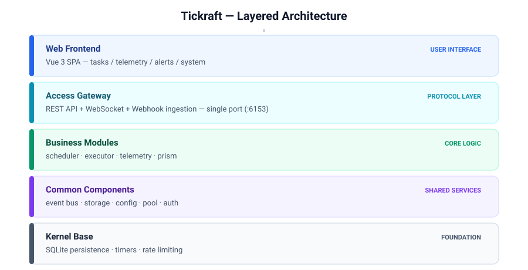
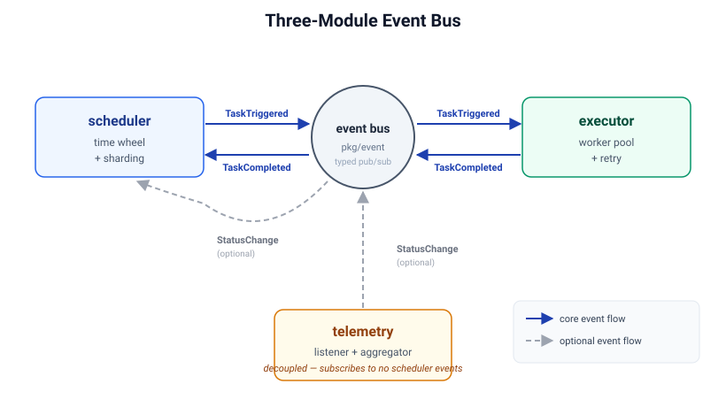

# 架构设计

> 本中文文档仅供参考，请以英文文档为准。
> Chinese translation is for reference only; the English documentation is authoritative.

## 概览

Tickraft 以单一自包含二进制文件形式发布，内置 REST API、Vue 3 单页应用、调度引擎、执行引擎、采集引擎与告警引擎。它将状态持久化到内嵌的 SQLite 数据库中，运行时无任何外部依赖，因此单个 `tickraft start` 进程即可运行整个产品。

运行时被组织为三个相互独立的子系统——**scheduler**、**executor** 与 **telemetry**——它们彼此从不互相导入。所有跨模块通信都通过一个强类型事件总线流转，从而保证每个子系统都可独立替换与测试。

## 分层架构

单个 HTTP 监听器（`server.addr`，默认 `:6153`）同时承载所有协议：JSON API 位于 `/api/v1/*`，Webhook 接收位于 `/webhook/*`，健康探针位于 `/healthz`，SPA 静态资源位于 `/`。开源版不存在多端口部署模式。

## 三模块架构

scheduler、executor 与 telemetry 被刻意解耦。它们不共享任何 Go 包，不调用彼此的方法，完全通过发布类型化事件来协同。

### scheduler —— 纯调度引擎

scheduler 仅负责决定任务 *何时* 运行：

- **任务元数据** —— 任务的注册、更新、删除，以及任务定义的内存缓存。
- **触发** —— 分层时间轮结合 cron 表达式计算下一次触发时间，并在到期时发布 `TaskTriggered` 事件。
- **分片** —— 分片管理器决定当前节点是否拥有某个任务，因此多实例可以分担工作而不会重复执行。
- **依赖跟踪** —— 下游任务只在上游依赖成功完成后才会触发。
- **事件驱动触发** —— scheduler 订阅 `TaskCompleted` 以更新依赖状态，订阅 `StatusChange` 以触发事件驱动任务。

scheduler 从不导入 executor 包；它对任务 *如何* 被执行一无所知。

### executor —— 任务执行引擎

executor 订阅 `TaskTriggered`，查找对应的 executor 实现，执行它，并发布 `TaskCompleted` 回执。

- **Worker 池** —— 有界信号量限制并发执行数（默认 100）；当饱和时，工作降级为内联执行，而不会无限制地创建 goroutine。
- **重试** —— 从任务元数据中读取重试次数与间隔，并透明地应用。
- **状态推断** —— 每次执行的结果被映射为资源状态（`Normal` / `Abnormal`）。
- **Executor 注册表** —— executor 按名称注册并声明能力位掩码：写动作（`local` 命令、`webhook` 通知回调）、只读探测（`icmp`、`tcp`、`mqtt_probe` MQTT CONNECT 检查），以及双模式的 `http`（`CapProbe | CapExec`，既探测端点也可作为定时任务动作）。创建任务时会拒绝不具备写能力的类型，创建主动探测点时会拒绝不具备探测能力的类型，均直接返回 400。
- **操作类型与记录路由** —— 每次执行都携带操作类型（`probe` 或 `execute`）。执行完的记录交给装配层接线的路由存储：`execute` 记录落入任务执行日志（`sys_schedule_execution`），`probe` 记录落入 telemetry 探测记录表（`sys_probe_record`）。两个领域包互不感知对方的存储。

### telemetry —— 数据采集引擎

telemetry 摄取外部上报的数据，并与 scheduler 完全解耦——它不订阅任何 scheduler 事件。

- **Listener SPI** —— 被动接收器将每个接收通道（webhook、syslog、SNMP trap、MQTT 等）建模为一个 `Listener`。
- **主动探测** —— 监控点以合成任务的形式经 scheduler/executor 管道调度探测。每次结果存为一条结构化探测记录——每次探测一行，保存状态、时延、状态码、输出与错误——并刷新监控点的运行时状态列。探测记录是运行时执行的一次操作的结果；它不同于 listener 从外部上报方摄取的日志与指标，后者是对资产的观测。
- **校验器** —— 入站报告会被检查结构正确性、资产存在性、租户归属以及大小限制。
- **聚合器** —— 指标被分桶到固定的滚动窗口中，并归约为 avg / max / min / count / sum 统计值。
- **持久化** —— 指标与日志被批量写入存储。
- **内置 HTTPListener** —— 开箱即用的 HTTP 端点，支持 HMAC-SHA256 签名或 asset-key 认证。

## 事件总线

事件总线（`pkg/event`）是三个模块之间唯一的通信通道。它通过泛型提供强类型的发布/订阅，因此事件载荷在编译期就会被检查。

| 事件               | 发布者     | 订阅者                | 用途                                       |
|-------------------|------------|-------------------|------------------------------------------|
| `TaskTriggered`   | scheduler  | executor          | 任务到期；executor 应执行它。              |
| `TaskCompleted`   | executor   | scheduler         | 执行完成；更新依赖。                       |
| `StatusChange`    | telemetry  | scheduler（可选） | 资源状态变化；触发事件驱动任务。           |

执行生命周期事件携带 `operation` 字段（`probe` 或 `execute`）；消费方将空值按 `execute` 处理，以兼容该字段出现之前发布的事件。

telemetry 从不订阅 scheduler 事件，这保证了采集引擎可以独立运行。

## 数据流

1. **调度 → 执行** —— 时间轮触发 → 发布 `TaskTriggered` → executor runner 消费 → executor 执行（带重试）→ 推断状态 → 发布 `TaskCompleted` → scheduler 更新依赖 → 持久化执行记录。
2. **接收 → 持久化** —— 外部报告 → listener 接收 → 校验器检查 → processor 判定状态 → 状态管理器检测变化 → 聚合器对指标分窗口 → 持久化批量写入指标与日志。
3. **事件驱动** —— telemetry 发出 `StatusChange` → scheduler 订阅 → 触发关联的事件驱动任务 → 流入调度 → 执行路径。
4. **主动探测 → 记录** —— 监控点触发 → 发布合成探测任务 → executor 执行探测 → `probe` 记录被路由到 `sys_probe_record` 并刷新监控点的运行时状态。任务执行走同一条管道但持久化到 `sys_schedule_execution`；由操作类型决定落库目的地。

## 公共组件

- **config**（`pkg/config`）—— 加载 YAML，插值环境变量（`${VAR}` / `${VAR:-default}`），并在启动前校验配置文件。
- **pool**（`pkg/pool`）—— 统一的 goroutine 池管理器。系统中每个并发任务（executor、通知、维护循环、listener）都通过它提交；禁止裸 `go` 语句。
- **db**（`pkg/db`）—— 位于 SQLite 之上的存储抽象。业务模块通过该层读写，而不是直接发起原始 SQL。
- **prism / 告警**（`pkg/prism`）—— 告警引擎订阅告警事件，将其与规则匹配，并通过可插拔 channel 分发通知（开源版内置 webhook channel）。告警规则位于 `pkg/prism/alert`，channel 位于 `pkg/prism/channel`，修复位于 `pkg/prism/remediation`。
- **auth**（`pkg/auth`）—— JWT 签发、token 黑名单、bcrypt 密码散列与内置管理员用户。

## 仓库分层：`pkg/` 与 `internal/`

开源仓库是内核；下游版次导入它且绝不修改它。以下分层规则保证内核自身完整可运行，同时让各版次无需分叉即可产生差异。

| 规则 | 约束 |
|------|------|
| L-01 | 本仓库与下游版次共同使用的代码放 `pkg/`。 |
| L-02 | 仅单个版次使用的代码放该版次自己的 `internal/`。 |
| L-03 | 版次差异通过 Option、接口或装饰器注入——实现绝不在仓库之间复制。 |
| L-04 | 依赖单向：`internal/` → `pkg/`。`pkg/` 包 import `internal/` 属于构建错误，CI 会拦截。 |
| L-05 | 领域包自包含：模型、存储、引擎、服务契约与默认实现放在一起（`pkg/task`、`pkg/telemetry`、`pkg/system`、`pkg/prism/*`）。不为每层单设顶层包；详见[领域包文件布局](#领域包文件布局)。 |
| L-06 | `pkg/api` 是纯传输层——server、TLS、中间件、HTTP handler 与路由组合根（`pkg/api/router`）。领域包禁止 import `pkg/api`。 |

### 领域包文件布局

每个领域包根统一采用四件套加行为文件：

| 文件 | 内容 |
|------|------|
| `model.go` | 全部持久化模型（gorm/json 双 tag）与模型词汇：枚举、状态常量、`TableName`、模型方法。新表一律落这里，绝不另起新文件。 |
| `ports.go` | 全部消费侧接口——Store SPI、Service SPI、引擎缝——及其参数/结果类型（query、filter、summary、wire 结果结构）。 |
| `store.go` | 全部 GORM store 实现与 `Migrate`。新 store 一律落这里。 |
| `service.go` | `<Domain>Service` 实现及其构造函数。 |
| （其余） | 仅行为内聚文件：`engine.go`、`events.go`、`env.go`、`validator.go`、`aggregation.go`…… |

命名规则：Service SPI 为 `<域>.Service`，实现为 `<Domain>Service`，调度/加工引擎类型为 `Engine`。不使用 `types.go` 文件名——纯模型内容归 `model.go`，非模型值类型溶入其消费文件（`pkg/auth` 的 `types.go` 是唯一历史例外）。

Store 消费默认使用具体 store 类型（`*Store`、`*ExecutionStore`……）；窄接口仅存在于真实消费者恰好只需要该切面之处——引擎的 `task.Store`/`alert.Lister` 缝，以及 `pkg/api/handler/telemetry` 中仅查询的 metric/log/probe 接口。CRUD handler 直接持具体 store；不为对称性而给 store 造接口。

在本仓库中，`internal/` 只承载版次装配——`cli`（入口接线）、`service`（启动装配）、`quota`（配额默认值）与 `web`（SPA 嵌入）。全部业务逻辑都在 `pkg/`。当某个包的唯一使用者是下游版次时，它根本不该留在本仓库（见[死代码处置](#死代码处置)中的迁移先例）。

## 组合根与注入缝

路由注册位于共享组合根 `pkg/api/router`。`RegisterRoutes(server, jwtMgr, authService, assetKeyGetter, opts...)` 构建中间件链并绑定全部 handler：

- **必填服务** —— auth、task、alert、system、telemetry 五个服务加 JWT 中间件在一处校验（`pkg/api/handler` 的 `validateRouteConfig`）；缺失任何一项启动即失败并给出一条描述性错误，而不是各路由各自 nil panic。
- **可选面** —— 其余组件（channel、remediation、证书、websocket、i18n、遥测上报 handler 等）均为 `RegisterOption`；组合根对每一项做 nil 保护并优雅降级。
- **版次缝** —— `WithAPIKeyAuth()` 让部署选择在 JWT 之外启用 API-key 认证（缺省时链路为纯 JWT）；`WithUserRevoker(...)` 把 token 吊销挂入修改密码流程；版次以方法值或适配器形式的普通函数传入。

下游版次绝不复制 router。其 `internal/api` 只承载版次特有路由（插件、许可、限流），并把内核服务——经装饰器包装——以 Option 形式传入 `RegisterRoutes`。

领域包遵循同样的缝纪律：

- `pkg/task` —— `TaskService` 接受 nil 引擎（Manager）；不承担调度角色的节点以纯任务 CRUD 运行。
- `pkg/prism/alert` —— `AlertService` 通过最小 `ReloadFunc` 重载规则，而不依赖具体引擎类型；`pkg/prism/channel` 以 `Runtime` 缝打断对 prism 的 import 环。
- 跨切面的版次行为以装饰器挂在共享服务外（例如同步数据变更），绝不以分叉副本存在。

## 新增包决策树

1. 本仓库与下游版次都会用？→ `pkg/`。
2. 仅本版次用？→ `internal/`。
3. 共享行为但存在版次变体？→ 基础实现放 `pkg/` 并留 Option 或接口缝；变体经缝注入（L-03）。
4. 绝不在下游仓库内创建 `pkg/` 实现的镜像副本——扩展它或装饰它。
5. 新建包之前先检查是否应并入既有包。单文件微包应被合并而非累积（先例：`pkg/api/hlogzap` 并入 `pkg/api`、`pkg/auth/password` 并入 `pkg/auth`、`pkg/prism/channel/format` 在唯一使用者处内联、`pkg/db/errmap` 在迫使其独立成包的 import 环消失后并入 `pkg/db`）。

## 死代码处置

发现无引用代码时，按以下顺序处置：

1. **功能对照** —— 同一能力是否已在别处更完整地实现？若存在已接线的更强等价实现，删除较弱者。（先例：旧 `internal/auth` 登录流程之于 `pkg/auth.Service.Login`，后者额外具备限流、禁用检查与失败记录。）
2. **产品形态** —— 是否有版次真正暴露该功能？两个版次都无入口且别处已有等价覆盖 → 删除。（先例：自注册在任何版次都没有入口。）
3. **未完成但需要** —— 功能未完成而产品需要时，补全实现而不是删除。以两仓现有实现为规格参照。
4. **拿不准** —— 记入审计文档待决策清单，代码原样保留。

迁移——而非删除——适用于只是站错分层位置的活代码：`pkg/console` 迁往其唯一使用者的 `internal/` 树，而不是被删除。

## 持久化模型

开源版将所有状态持久化到单个 SQLite 文件中。每张业务表都带有 `tenant_id` 列以实现行级隔离；尽管开源版默认是单租户的，但该列已存在，下游扩展可以在不做 schema 迁移的情况下启用多租户。数据库 schema 由 GORM `AutoMigrate` 在启动时管理——无需维护手写迁移 SQL。每个域包拥有自己表的迁移（`user.Migrate`、`auth.Migrate`、`alert.Migrate`……），由组合层在启动时按序调用；`pkg/db` 是纯基础设施（连接、DSN 解析、错误映射），不 import 任何域包。

执行结果存放在两张领域自有的表中：`sys_schedule_execution` 保存任务执行（`execute` 操作），`sys_probe_record` 保存监控点探测（`probe` 操作）。被动采集数据保存在 `sys_probe_metric` 与 `sys_probe_log` 中。

全部生产表遵循同一命名约定：`sys_` 前缀 + 单数名词（`sys_user`、`sys_asset`、`sys_monitor_point`……）。存储名与代码词表刻意解耦 —— telemetry 三套词表到存储的映射为：监控点词表（`MonitorPoint` 类型、points API）落 `sys_monitor_point`；主动探测执行记录（`ProbeRecord`）落 `sys_probe_record`；被动采集数据（被动采集路径上的 `collect` 指标/日志词表）落 `sys_probe_metric` 与 `sys_probe_log`。规则行（告警、自愈）软删除并保留审计；高量记录与日志行走保留期硬删除。

## 相关文档

- [部署指南](./deployment.md) —— 二进制、Docker 与开发环境部署。
- [配置说明](./configuration.md) —— 每个配置字段详解。
- [快速入门](./getting-started.md) —— 五分钟内从零到第一个任务。
- [用户指南](./user-guide.md) —— Web UI 各页面 walkthrough。
- [扩展指南](./extension-guide.md) —— 如何添加 executor、listener、channel 与 API 插件。
- [模块边界](./module-boundary.md) —— 保持三模块解耦的规则。
- [OpenAPI 规范](../api/openapi.yaml) —— REST API 路径与模式。
